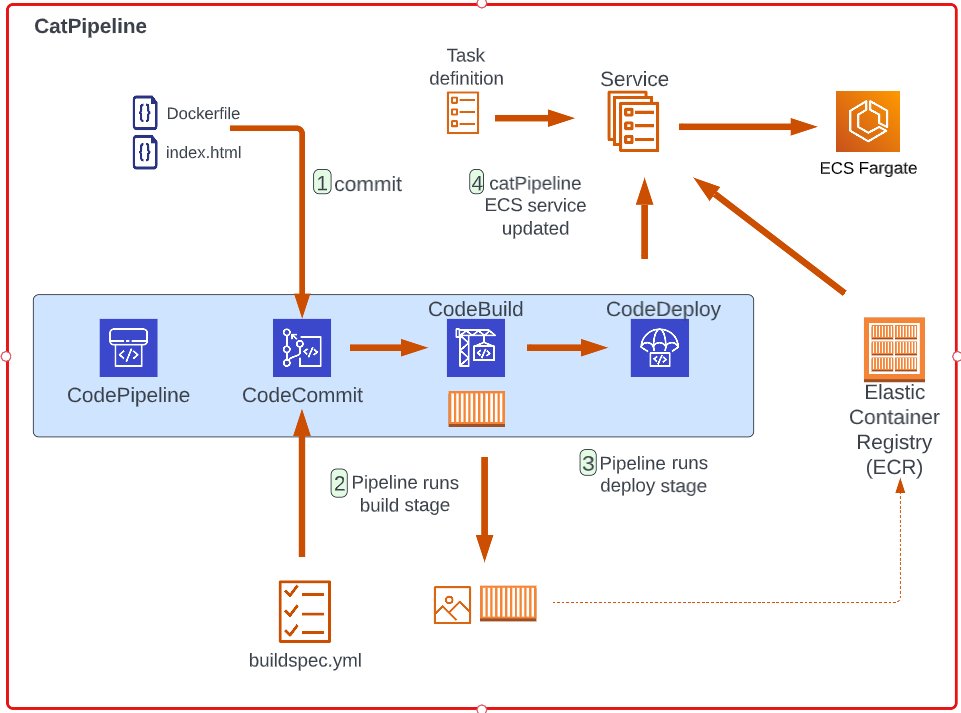
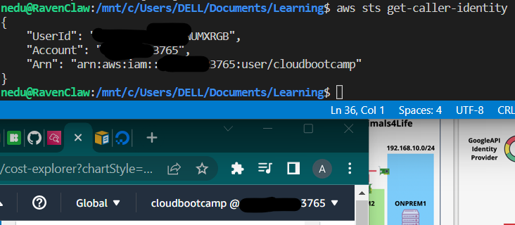

# Week 0 — Billing and Architecture

# Week-0: Billing and Architecture
## Architecture
This section represents the requested architectural diagrams for Cruddur

I made both conceptual and Logical diagrams using Lucid charts.

This is my submission for [Conceptual diagram](https://lucid.app/lucidchart/c50b264f-e17b-495d-9a39-5c23ddbec7a0/edit?viewport_loc=-2394%2C-322%2C2606%2C1216%2C0_0&invitationId=inv_09077203-7296-45c4-a02d-c4c66242c2c7) using Lucid chart 


This is my subsmission for [Logical diagram](https://lucid.app/lucidchart/c50b264f-e17b-495d-9a39-5c23ddbec7a0/edit?viewport_loc=-594%2C-151%2C2222%2C1037%2CLvNx.WRbXoQp&invitationId=inv_09077203-7296-45c4-a02d-c4c66242c2c7) using Lucid chart  


Here is my remake and proof of Adrian Cantril's [catPipeline diagram](https://lucid.app/lucidchart/f7bcd2b9-4ed3-4427-ad7b-3abdf8624cf3/edit?viewport_loc=-291%2C-1066%2C1737%2C811%2C0_0&invitationId=inv_7b6ed873-291f-471d-aedd-c38b16584e0d)



## Billing
For the Billing related tasks, I watched all available videos and followed [Chirag's video](https://www.youtube.com/watch?v=OVw3RrlP-sI&list=PLBfufR7vyJJ7k25byhRXJldB5AiwgNnWv&index=13) to complete this task.

I however already used this as guidance to create my budget and billing alarms before watching Andrew's video using CLI. I only created one budget in order not to exceed the free tier limit and rack up any bills.

Please find proof of my budget and billing alarms below:

Budget:


Billing Alarms:


## AWS Account and CLI Installation

### AWS Account (IAM User)
I first set MFA on my root account using Google Authenticator then created an IAM user(without enabling MFA) which I added to the Admin group. 


All implementations henceforth were done via the created user account.
I also generated access keys via `Security Credentials` section of the user account and downloaded CSV for reference.

### AWS CLI Installation
After adding the Gitpod extension on my Chrome browser successfully, I lauched a workspace and configured AWS CLI with the string of commands below
These commands were gotten from the [AWS CLI Linux installation guide](https://docs.aws.amazon.com/cli/latest/userguide/getting-started-install.html):

```
curl "https://awscli.amazonaws.com/awscli-exe-linux-x86_64.zip" -o "awscliv2.zip"
unzip awscliv2.zip
sudo ./aws/install
```

I installed on both Gitpod and local terminal.

#### Local Terminal AWS CLI Installation

While installing on my terminal I encountered and issue unzipping the folder because **unzip** was not installed.


I resolved this using the code below:

```
sudo apt install unzip
```
Here is a proof of my working AWS CLI installation:



#### Gitpod AWS CLI Installation

I also installed AWS CLI on Gitpod using same method as my local terminal

See output for proof
```
gitpod /workspace $ sudo ./aws/install
You can now run: /usr/local/bin/aws --version

```

After installation, I tried to retrieve AWS CLI info using `aws sts get-caller-identity` but encountered error below:

```
gitpod /workspace $ aws sts get-caller-identity

Unable to locate credentials. You can configure credentials by running "aws configure".
```

I resolved this by setting env variables for the Gitpod environment using the code below retrieved from [AWS CLI Env Variable](https://docs.aws.amazon.com/cli/latest/userguide/cli-configure-envvars.html) page


**Note that the values for the variables are ommited for security reasons
```
export AWS_ACCESS_KEY_ID=""
export AWS_SECRET_ACCESS_KEY=""
export AWS_DEFAULT_REGION="us-east-1"
```


These variables were not persistent as they were in use for just one session.
In order to make them persistent, I configured Gitpod to retain the details with the command below:

```
gp env AWS_ACCESS_KEY_ID=""
gp env AWS_SECRET_ACCESS_KEY=""
gp env AWS_DEFAULT_REGION="us-east-1"
```
Proof of Gitpod AWS CLI configuration works:


