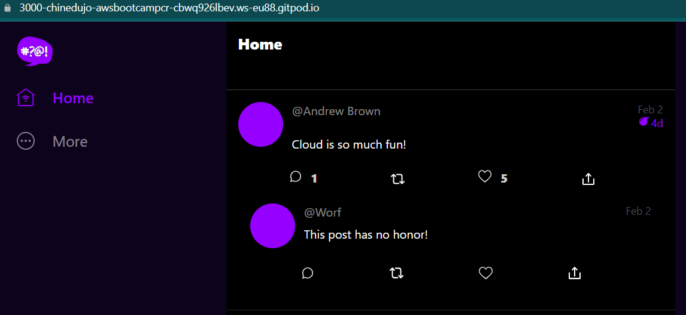

# Week 1 — App Containerization

To run the Backend application - Python(flask), I had to install all components in the requirements.txt file with the command:

```sh
cd backend-flask/
pip3 install -r requirements.txt
python3 -m flask run --host=0.0.0.0 --port=4567
```
On Gitpod, I opened port 4567 to the public and tested the application with the URL `https://4567-chinedujo-awsbootcampcr-tu0h0msihgu.ws-eu87.gitpod.io/api/activities/home` and got error below:

```
Not Found

The requested URL was not found on the server. If you entered the URL manually please check your spelling and try again.
```

So I stopped the running application and set the required variables found in `app.py` file:

```sh
export FRONTEND_URL="*"
export BACKEND_URL="*"
```
Then restarted the application

```sh
python3 -m flask run --host=0.0.0.0 --port=4567
```

Browser View:


## Containerize Docker Application
I built a [Backend Dockerfile](/backend-flask/Dockerfile) and [Frontend Dockerfile](/frontend-react-js/Dockerfile)

To ensure the preset env variable were not being used by the application, I unset them

```sh
unset FRONTEND_URL
unset BACKEND_URL
```
Built docker file for both frontend and backend applications:

Backend Dockerfile:

```dockerfile
FROM python:3.10-slim-buster

WORKDIR /backend-flask

COPY requirements.txt requirements.txt

RUN pip3 install -r requirements.txt

COPY . .

ENV FLASK_ENV=development

EXPOSE ${PORT}

CMD [ "python3", "-m", "flask", "run", "--host=0.0.0.0", "--port=4567" ]

```

### Backend Docker build and run sequence

To build the docker images, input the following:

```sh
docker build -t backend-flask ./backend-flask
```
Confirm the images has been created with the command:

```sh
docker images
```
To see running containers and all available containers:

```sh
docker ps
docker ps -a
```

To run the build images as container, input the following:

```sh
docker run --rm -p 4567:4567 -e FRONTEND_URL="*" -e BACKEND_URL="*" backend-flask
```

OR break commands into multiple lines:

```sh
docker run --rm \
-p 4567:4567 \
-e FRONTEND_URL="*" \
-e BACKEND_URL="*" \
backend-flask
```


### Frontend Docker build and run sequence
First ensure you are in the right directory then install dependencies.

```sh
cd /frontend-react-js
npm install
```
Frontend Dockerfile content:

*Note I used base image of node:16.19-alpine to keep application lightweight*

```dockerfile
FROM node:16.19-alpine

WORKDIR /frontend-react-js

COPY . /frontend-react-js

RUN npm install

ENV PORT=3000

EXPOSE ${PORT}

CMD ["npm", "start"]
```

### Starting up applications with docker-compose


```dockerfile
version: "3.8"
services:
  backend-flask:
    environment:
      FRONTEND_URL: "https://3000-${GITPOD_WORKSPACE_ID}.${GITPOD_WORKSPACE_CLUSTER_HOST}"
      BACKEND_URL: "https://4567-${GITPOD_WORKSPACE_ID}.${GITPOD_WORKSPACE_CLUSTER_HOST}"
    build: ./backend-flask
    ports:
      - "4567:4567"
    volumes:
      - ./backend-flask:/backend-flask
  frontend-react-js:
    environment:
      REACT_APP_BACKEND_URL: "https://4567-${GITPOD_WORKSPACE_ID}.${GITPOD_WORKSPACE_CLUSTER_HOST}"
    build: ./frontend-react-js
    ports:
      - "3000:3000"
    volumes:
      - ./frontend-react-js:/frontend-react-js
networks: 
  internal-network:
    driver: bridge
    name: cruddur
```

Started up the applications using the command below:

```sh
docker-compose up
```
Result:


### Notification pane task

I followed the instruction video and successfully got the application working


## STRETCH HOMEWORK
To ensure all dependencies are installed on launching Gitpod, I added the following to gitpod.yml file

```yaml
- name: Install Frontend and Backend dependencies
    init: |
      cd /workspace/aws-bootcamp-cruddur-2023/backend-flask
      pip3 install -r requirements.txt
      cd /workspace/aws-bootcamp-cruddur-2023/frontend-react-js
      npm i
```

### Push local Docker images to Docker Hub

I built the frontend app only and pushed to Docker Hub to be reusable on remote systems:

The frontend app image was built with the commands below:
```sh
cd frontend-react-js/
docker build -t frontend-react-js:v1 .
```

To push to Docker hub, you first have to login Docker then tag the image correctly to reflect the docker user and repo

Login:

```sh
docker login
```
Prompt to input login credentials and success message:

```
Login with your Docker ID to push and pull images from Docker Hub. If you don't have a Docker ID, head over to https://hub.docker.com to create one.
Username: nedudev
Password: 
WARNING! Your password will be stored unencrypted in /home/gitpod/.docker/config.json.
Configure a credential helper to remove this warning. See
https://docs.docker.com/engine/reference/commandline/login/#credentials-store

Login Succeeded
```

**Tag the images as below:**
```sh
docker tag frontend-react-js:v1 nedudev/frontend-react-js:1.0
```

**Push image as below:**
```sh
docker push nedudev/frontend-react-js:1.0
```

Output:

```sh
The push refers to repository [docker.io/nedudev/frontend-react-js]
3b8430c53a72: Pushed 
80b568d369dd: Pushed 
747aed1e6526: Pushed 
67246b9bbb93: Mounted from library/node 
a1ce792246f9: Mounted from library/node 
af1fa49a98d8: Mounted from library/node 
7cd52847ad77: Mounted from library/node 
1.0: digest: sha256:968aa7c31498c16cf9e85e3c0b9d08db6ee8e43feae5bff2b6f1088a5e86b6aa size: 1788
```


**logout of docker to remove stored credentials:**

```sh
docker logout
```

Output:

```
Removing docker login credentials for https://index.docker.io/v1/
```

### Implement Healthcheck on Docker Compose for Frontend application

I learnt to do this via a [docker-compose healthcheck article](https://medium.com/geekculture/how-to-successfully-implement-a-healthcheck-in-docker-compose-efced60bc08e)
Healthcheck was implemented  with the command below:

```dockerfile
frontend-react-js:
    environment:
      REACT_APP_BACKEND_URL: "https://4567-${GITPOD_WORKSPACE_ID}.${GITPOD_WORKSPACE_CLUSTER_HOST}"
    build: ./frontend-react-js
    ports:
      - "3000:3000"
    volumes:
      - ./frontend-react-js:/frontend-react-js
    #Frontend application Healthcheck code
    healthcheck:
      test: curl --fail https://3000-${GITPOD_WORKSPACE_ID}.${GITPOD_WORKSPACE_CLUSTER_HOST}/api/activities/home
      interval: 30s
      timeout: 10s
      retries: 5
      start_period: 30s
```

I was met with ``unhealthy`` healthcheck result.

```
CONTAINER ID   IMAGE                                         COMMAND                  CREATED         STATUS                     PORTS                                       NAMES
f2fdb9d39c95   aws-bootcamp-cruddur-2023-backend-flask       "python3 -m flask ru…"   3 minutes ago   Up 3 minutes               0.0.0.0:4567->4567/tcp, :::4567->4567/tcp   aws-bootcamp-cruddur-2023-backend-flask-1
911ab242f17a   aws-bootcamp-cruddur-2023-frontend-react-js   "docker-entrypoint.s…"   3 minutes ago   Up 3 minutes (unhealthy)   0.0.0.0:3000->3000/tcp, :::3000->3000/tcp   aws-bootcamp-cruddur-2023-frontend-react-js-1
```
I drilled down to the root of the problem after I tested the test curl on my local terminal with a successful message.

```
gitpod /workspace/aws-bootcamp-cruddur-2023/frontend-react-js (main) $ curl --fail https://3000-${GITPOD_WORKSPACE_ID}.${GITPOD_WORKSPACE_CLUSTER_HOST}
<!DOCTYPE html>
<html lang="en">
  <head>
    <meta charset="utf-8" />

    <link rel="apple-touch-icon" sizes="180x180" href="/apple-touch-icon.png">
    <link rel="icon" type="image/png" sizes="32x32" href="/favicon-32x32.png">
    <link rel="icon" type="image/png" sizes="16x16" href="/favicon-16x16.png">
    <link rel="manifest" href="/site.webmanifest">
    <link rel="mask-icon" href="/safari-pinned-tab.svg" color="#5bbad5">
    <meta name="msapplication-TileColor" content="#da532c">
    <meta name="theme-color" content="#ffffff">

    <meta name="viewport" content="width=device-width, initial-scale=1" />

    <meta name="description" content="Cruddur"/>
    <title>Cruddur</title>
  <script defer src="/static/js/bundle.js"></script></head>
  <body>
    <noscript>You need to enable JavaScript to run this app.</noscript>
    <main></main>
    <!--
      This HTML file is a template.
      If you open it directly in the browser, you will see an empty page.

      You can add webfonts, meta tags, or analytics to this file.
      The build step will place the bundled scripts into the <body> tag.

      To begin the development, run `npm start` or `yarn start`.
      To create a production bundle, use `npm run build` or `yarn build`.
    -->
  </body>
</html>
```

I logged into the container and noticed ``curl`` was not installed so I added the installation command to the frontend Dockerfile as advised in the referenced [docker-compose healthcheck article](https://medium.com/geekculture/how-to-successfully-implement-a-healthcheck-in-docker-compose-efced60bc08e)

**Accessing Container:**
```sh
docker exec -it 911ab242f17a /bin/sh
```
Prompt:

```
/frontend-react-js # curl --fail https://3000-${GITPOD_WORKSPACE_ID}.${GITPOD_WORKSPACE_CLUSTER_HOST}
/bin/sh: curl: not found
```

**Command added to Frontend Dockerfile to install Curl:**

```dockerfile
RUN apk --update --no-cache add curl
```
I had to delete the existing Frontend built image after making changed to the Dockerfile and run docker-compose up

```sh
docker-compose up
```
Output:
```sh
[+] Building 27.2s (10/10) FINISHED                                                                                                      
 => [internal] load build definition from Dockerfile                                                                                0.0s
 => => transferring dockerfile: 224B                                                                                                0.0s
 => [internal] load .dockerignore                                                                                                   0.0s
 => => transferring context: 2B                                                                                                     0.0s
 => [internal] load metadata for docker.io/library/node:16.19-alpine                                                                0.0s
 => [1/5] FROM docker.io/library/node:16.19-alpine                                                                                  0.0s
 => [internal] load build context                                                                                                   3.9s
 => => transferring context: 78.59MB                                                                                                3.8s
 => CACHED [2/5] WORKDIR /frontend-react-js                                                                                         0.0s
 => [3/5] COPY . /frontend-react-js                                                                                                 4.7s
 => [4/5] RUN npm install                                                                                                          11.2s
 => [5/5] RUN apk --update --no-cache add curl                                                                                      1.2s
 => exporting to image                                                                                                              6.1s 
 => => exporting layers                                                                                                             6.1s 
 => => writing image sha256:67fbeec1bc74dd540a6b4273abb472186957e539f04f7ff41185ef4e3740d429                                        0.0s 
 => => naming to docker.io/library/aws-bootcamp-cruddur-2023-frontend-react-js                                                      0.0s
 ```

Output:
**Notice the status is now `healthy`**
```sh
CONTAINER ID   IMAGE                                         COMMAND                  CREATED          STATUS                    PORTS                                       NAMES
8fcb734ab56b   aws-bootcamp-cruddur-2023-frontend-react-js   "docker-entrypoint.s…"   53 seconds ago   Up 51 seconds (healthy)   0.0.0.0:3000->3000/tcp, :::3000->3000/tcp   aws-bootcamp-cruddur-2023-frontend-react-js-1
```

### Launch AWS EC2 instance and install Docker

#### Run AWS EC2 instance
I resumed a previously stopped instance and accessed it via SSH

```sh
chmod 400 {inserts .pem private key file}
ssh -i "{.pem private key}" {EC2 Public IPv4 DNS}
```

**Install updates before installing docker**:

```sh
sudo yum install update -y
```

#### Install Docker on Remote machine

I noticed docker was not installed

```
[ec2-user@ip-172-31-87-205 ~]$ docker
-bash: docker: command not found
```

Docker Daemon installation:

```sh
sudo yum install docker.x86_64 er
```

I also observed the docker service was not running:

```sh
$ sudo service docker status
Redirecting to /bin/systemctl status docker.service
● docker.service - Docker Application Container Engine
   Loaded: loaded (/usr/lib/systemd/system/docker.service; disabled; vendor preset: disabled)
   Active: inactive (dead)
     Docs: https://docs.docker.com
```

I started the service with command:

```sh
$ sudo service docker start
Redirecting to /bin/systemctl start docker.service
```

To confirm docker version, I used the command:

```sh
$ sudo docker --version
```

Output:

```
Docker version 20.10.17, build 100c701
```

### Pull images from Docker Hub

I pulled our docker image from the Docker Hub:

```sh
sudo docker pull nedudev/frontend-react-js:1.0
```

Output:

```sh
$ sudo docker pull nedudev/frontend-react-js:1.0
1.0: Pulling from nedudev/frontend-react-js
63b65145d645: Pull complete
a67f65df360b: Pull complete
6112f742730b: Pull complete
4d4a28bae26a: Pull complete
64841e8e567c: Pull complete
44c6a6d6924a: Pull complete
184e1de99711: Pull complete
Digest: sha256:968aa7c31498c16cf9e85e3c0b9d08db6ee8e43feae5bff2b6f1088a5e86b6aa
Status: Downloaded newer image for nedudev/frontend-react-js:1.0
docker.io/nedudev/frontend-react-js:1.0
```

To see pulled image:

```sh
$ sudo docker ps
```

Output:

```sh
CONTAINER ID   IMAGE     COMMAND   CREATED   STATUS    PORTS     NAMES
[ec2-user@ip-172-31-87-205 ~]$ sudo docker images
REPOSITORY                  TAG       IMAGE ID       CREATED       SIZE
nedudev/frontend-react-js   1.0       db9198487dae   3 hours ago   359MB
```

Run container from image:

```sh
sudo docker run --rm -p 3000:3000 -d nedudev/frontend-react-js:1.0
```

Output:

```
$ sudo docker run --rm -p3000:3000 -d nedudev/frontend-react-js:1.0

5ff75f286af1b3a786ff26a1a2e7179647f74673234138f3e04868abce051e28
```

In order to access the application on port 3000, I had to add inbound ports to the security group.

Steps:
1. Go to Security Groups
2. Locate the security group configured for the EC2
3. Navigate to Inbound rules
4. Click Edit inbound rules:
  
  
You should have something similar to the below image:


### Frontend application on Remote machine

I got the frontend application to work and no doubt the backend would work exact same way


To avoid excess spend, I stopped the EC2 instance after confirmation.

