# Week 2 — Distributed Tracing
## Honeycomb Prep and Instrumentation

### Creating environment in Honeycomb
The environment (dev, staging, pre-prod, prod etc) is first created to differentiate working environments for different stages of your build or test.

I created an environment called `bootcamp`, API keys were generated automatically but can be created by clicking the `create API key` button
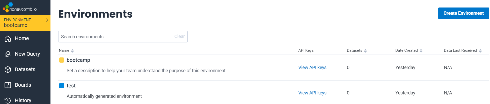

To retrieve API Keys, click `View API Keys` on the environment management dashboard and you will get a view just like this:

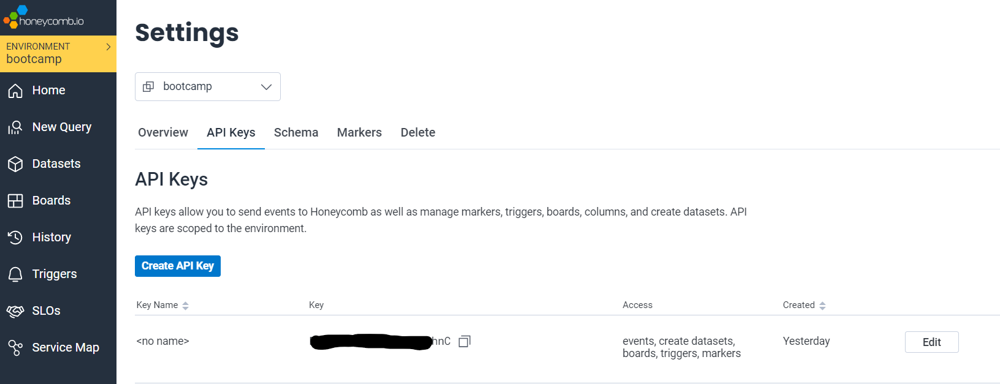

Copy the API Keys as you will be needing it in your code or terminal

### Export and save API key in Terminal
In terminal, set `env` variable
Use the `gp env` command to save the variable to Gitpod

```sh
export HONEYCOM_API_KEY ="input API key"
gp env HONEYCOM_API_KEY ="input API key"
```


We have to add environment variables to our docker-compose telling OpenTelemetry to send events to Honeycomb
This instruction can be found on the Honeycomb [OpenTelemetry documentation page](https://docs.honeycomb.io/getting-data-in/opentelemetry/python/)

```sh
export OTEL_EXPORTER_OTLP_ENDPOINT="https://api.honeycomb.io/"
export OTEL_EXPORTER_OTLP_HEADERS="x-honeycomb-team=your-api-key"
export OTEL_SERVICE_NAME="your-service-name"
```

Since we are adding to docker-compose file, we can input the above `env variable` without the `export` command. 

Each service in the docker-compose should have a unique `OTEL_SERVICE_NAME` to reflect the service specific data

```yml
services:
  backend-flask:
    environment:
      FRONTEND_URL: "https://3000-${GITPOD_WORKSPACE_ID}.${GITPOD_WORKSPACE_CLUSTER_HOST}"
      BACKEND_URL: "https://4567-${GITPOD_WORKSPACE_ID}.${GITPOD_WORKSPACE_CLUSTER_HOST}"
      OTEL_EXPORTER_OTLP_ENDPOINT: "https://api.honeycomb.io/"
      OTEL_EXPORTER_OTLP_HEADERS: "x-honeycomb-team=${HONEYCOMB_API_KEY}"
      OTEL_SERVICE_NAME: "backend-flask"
    build: ./backend-flask
```

### Install packages to instrument a Flask app with OpenTelemetry
The necessary packages needed for Flask can be found on the Honeycomb [OpenTelemetry documentation page](https://docs.honeycomb.io/getting-data-in/opentelemetry/python/) or on the Home page of Honeycomb under the `Python` section

To install the Python (Flask) packages, run the command below
```sh
pip install opentelemetry-api
pip install opentelemetry-sdk
pip install opentelemetry-exporter-otlp-proto-http
pip install opentelemetry-instrumentation-flask
pip install opentelemetry-instrumentation-requests
```

We can also add these packages as dependencies in the `requirements.txt` which will run as a prerequisite for the application

```txt
flask
flask-cors

opentelemetry-api
opentelemetry-sdk
opentelemetry-exporter-otlp-proto-http
opentelemetry-instrumentation-flask
opentelemetry-instrumentation-requests
```

### initialize a tracer and Flask instrumentation to send data to Honeycomb 

Add these lines to Flask app initialization file `app.py`

```html
# app.py updates
    
from opentelemetry import trace
from opentelemetry.instrumentation.flask import FlaskInstrumentor
from opentelemetry.instrumentation.requests import RequestsInstrumentor
from opentelemetry.exporter.otlp.proto.http.trace_exporter import OTLPSpanExporter
from opentelemetry.sdk.trace import TracerProvider
from opentelemetry.sdk.trace.export import BatchSpanProcessor

# Initialize tracing and an exporter that can send data to Honeycomb
provider = TracerProvider()
processor = BatchSpanProcessor(OTLPSpanExporter())
provider.add_span_processor(processor)
trace.set_tracer_provider(provider)
tracer = trace.get_tracer(__name__)

# Initialize automatic instrumentation with Flask
app = Flask(__name__)
FlaskInstrumentor().instrument_app(app)
RequestsInstrumentor().instrument()
```

Avoid duplicate `app = Flask(__name__)` if you already have an exisiting one in your `app.py` 

Here is the [commit](https://github.com/Chinedu-jo/aws-bootcamp-cruddur-2023/commit/8a3b21f9eae4e3cf0965d1f74b8a4b51e6057971) for implementing instrumentation 

Here is an image of the `Home` page after restarting container using `docker-compose up`
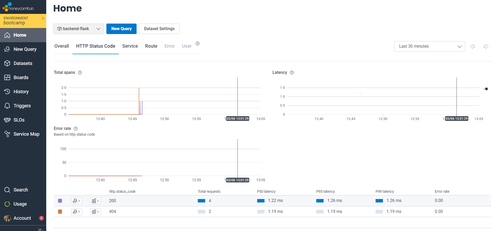

Here is an image of the reported `backend-flask` dataset
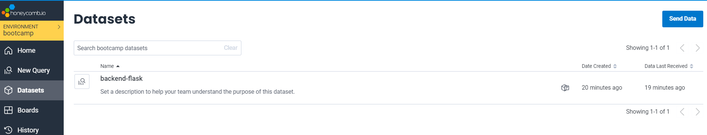

Here is an image of the span:
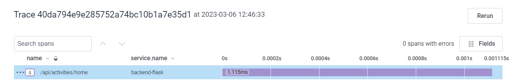

### Acquiring a tracer and adding a span

#### Acquiring a tracer

In your code `home_activities.py` add the following:

```py
from opentelemetry import trace

tracer = trace.get_tracer("home.activities")
```

#### Adding a Span

To add a span, include the following in your code `home_activities.py`

```py
from opentelemetry import trace

tracer = trace.get_tracer(__name__)
with tracer.start_as_current_span("home-activities-mock-data"):
```

The complete code should look something like this when done:

```py
from opentelemetry import trace

tracer = trace.get_tracer("home.activities")

class HomeActivities:
  def run():
    with tracer.start_as_current_span("home-activities-mock-data"):
      now = datetime.now(timezone.utc).astimezone()
      # code continues
```

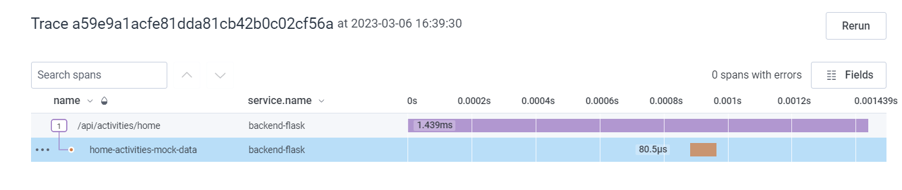


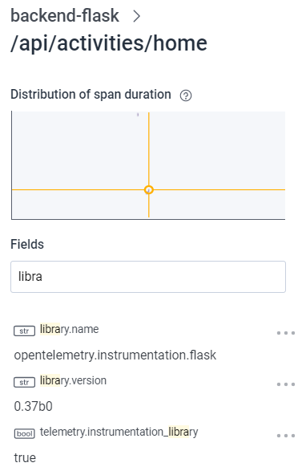


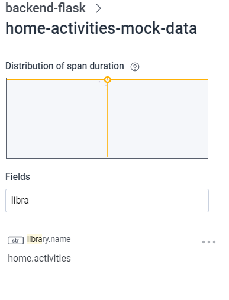


#### Creating additional attributes to the span

```py
  ...
    span = trace.get_current_span()
    now = datetime.now(timezone.utc).astimezone()
    span.set_attribute("app.now", now.isoformat())
  ...
  span.set_attribute("app.result_length", len(results))
  return results
```

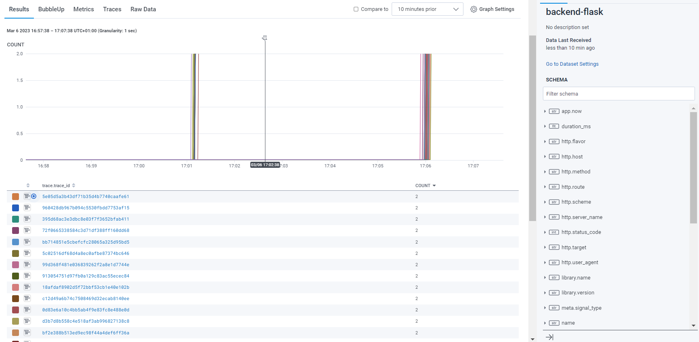


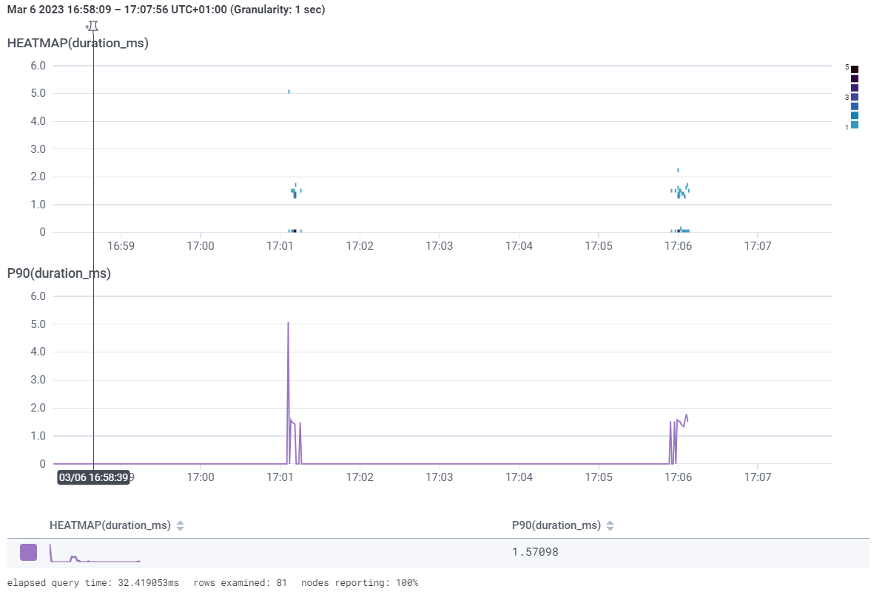


## Instrumentation with X-RAY

### Install X-RAY python SDK

```sh
pip install aws-xray-sdk
```

We can also include this in the `requirements.txt` file as a dependency

```text
aws-xray-sdk
```

Add this to `app.py` file

```py
# X-Ray
# Adding the middleware to Flask app
from aws_xray_sdk.core import xray_recorder
from aws_xray_sdk.ext.flask.middleware import XRayMiddleware

app = Flask(__name__) #Omit if already exists in code

# X-Ray
# Initialize X-RAY SDK Middleware
xray_url = os.getenv("AWS_XRAY_URL")
xray_recorder.configure(service='backend-flask', dynamic_naming=xray_url)
XRayMiddleware(app, xray_recorder)
```

### Adding a Sampling rule

Add sampling rule to `JSON` file in `aws/json/xray.json`

```json
{
  "SamplingRule": {
      "RuleName": "Cruddur",
      "ResourceARN": "*",
      "Priority": 9000,
      "FixedRate": 0.1,
      "ReservoirSize": 5,
      "ServiceName": "backend-flask",
      "ServiceType": "*",
      "Host": "*",
      "HTTPMethod": "*",
      "URLPath": "*",
      "Version": 1
  }
}
```

### Create group

In Terminal, input the command below to create AWS X-RAY group

```aws
FLASK_ADDRESS="https://4567-${GITPOD_WORKSPACE_ID}.${GITPOD_WORKSPACE_CLUSTER_HOST}"

aws xray create-group \
   --group-name "Cruddur" \
   --filter-expression "service(\"backend-flask\")"
```


### Create sampling rule

```sh
aws xray create-sampling-rule --cli-input-json file://aws/json/xray.json
```
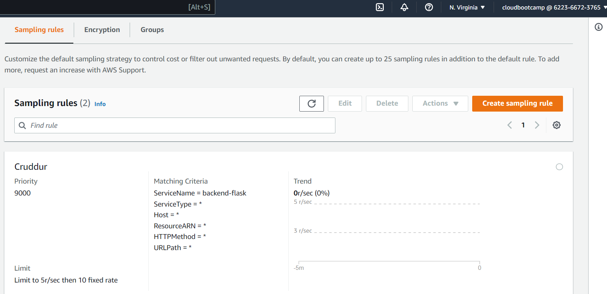


### Add X-Ray Daemon to Docker-compose

```yml
xray-daemon:
    image: "amazon/aws-xray-daemon"
    environment:
      AWS_ACCESS_KEY_ID: "${AWS_ACCESS_KEY_ID}"
      AWS_SECRET_ACCESS_KEY: "${AWS_SECRET_ACCESS_KEY}"
      AWS_REGION: "eu-central-1"
    command:
      - "xray -o -b xray-daemon:2000"
    ports:
      - 2000:2000/udp
```
#### Add X-RAY `env` variable to Backend service of Docker-compose file

```yml
...
services:
  backend-flask:
    environment:
      AWS_XRAY_URL: "*4567-${GITPOD_WORKSPACE_ID}.${GITPOD_WORKSPACE_CLUSTER_HOST}*"
      AWS_XRAY_DAEMON_ADDRESS: "xray-daemon:2000"
...
```
**Restart Docker-compose**

```sh
docker-compose down
docker-compose up
```

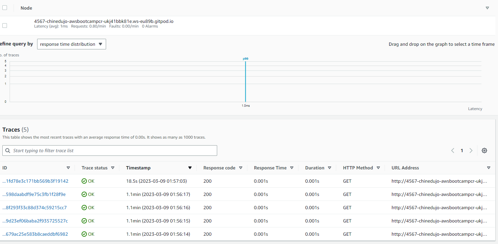


## Capturing Logs with Cloudwatch 

Add `watchtower` to `requirements.txt` file

```txt
watchtower
```
or

```sh
pip install watchtower
```

Import `watchtower` and `logging` to `app.py`

```py
import watchtower
import logging
from time import strftime
```

Configure logger to use Cloudwatch

In `app.py` add the following code:

```py
LOGGER = logging.getLogger(__name__)
LOGGER.setLevel(logging.DEBUG)
console_handler = logging.StreamHandler()
cw_handler = watchtower.CloudWatchLogHandler(log_group='cruddur')
LOGGER.addHandler(console_handler)
LOGGER.addHandler(cw_handler)
```

```py
@app.after_request
def after_request(response):
    timestamp = strftime('[%Y-%b-%d %H:%M]')
    LOGGER.error('%s %s %s %s %s %s', timestamp, request.remote_addr, request.method, request.scheme, request.full_path, response.status)
    return response
```
 
