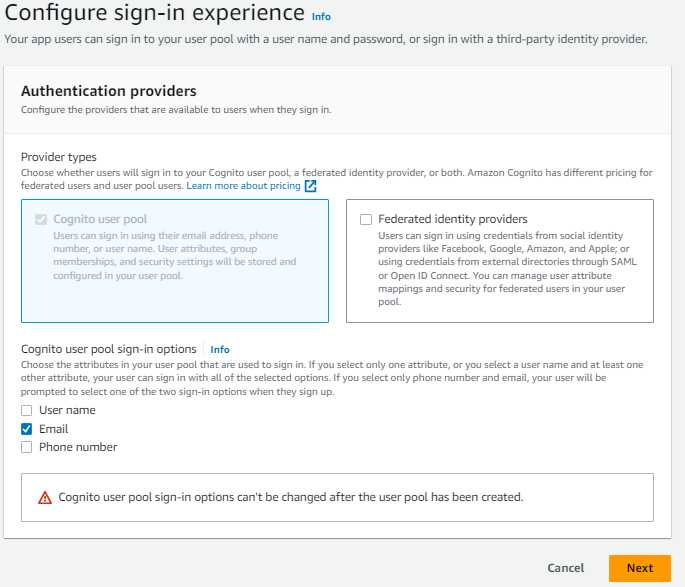
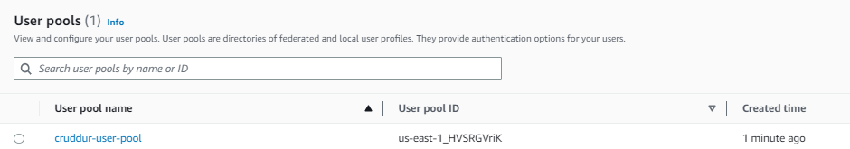

# Week 3 — Decentralized Authentication

## User Pool Creation








## AWS Amplify

### Install AWS Amplify Dependencies

```sh
cd frontend-react-js
npm i aws-amplify --save
```

Confirm that the dependency has been added to `package.json`


### Configure AWS Amplify

In `app.js` add the necessary libraries

```js
import { Amplify } from 'aws-amplify';

Amplify.configure({
  "AWS_PROJECT_REGION": process.env.REACT_APP_AWS_PROJECT_REGION,
  # "aws_cognito_identity_pool_id": process.env.REACT_APP_AWS_COGNITO_IDENTITY_POOL_ID,
  "aws_cognito_region": process.env.REACT_APP_AWS_COGNITO_REGION,
  "aws_user_pools_id": process.env.REACT_APP_AWS_USER_POOLS_ID,
  "aws_user_pools_web_client_id": process.env.REACT_APP_CLIENT_ID,
  "oauth": {},
  Auth: {
    // We are not using an Identity Pool
    // identityPoolId: process.env.REACT_APP_IDENTITY_POOL_ID, // REQUIRED - Amazon Cognito Identity Pool ID
    region: process.env.REACT_APP_AWS_PROJECT_REGION,           // REQUIRED - Amazon Cognito Region
    userPoolId: process.env.REACT_APP_AWS_USER_POOLS_ID,         // OPTIONAL - Amazon Cognito User Pool ID
    userPoolWebClientId: process.env.REACT_APP_AWS_USER_POOLS_WEB_CLIENT_ID,   // OPTIONAL - Amazon Cognito Web Client ID (26-char alphanumeric string)
  }
});
```
#### Add env variables

Add the `env var` to `frontend` service of `docker-compose.yml` file

```yml
REACT_APP_AWS_PROJECT_REGION: "${AWS_DEFAULT_REGION}"
REACT_APP_AWS_COGNITO_REGION: "${AWS_DEFAULT_REGION}"
REACT_APP_AWS_USER_POOLS_ID: "us-east-1_NtP7bO0hz"
REACT_APP_CLIENT_ID: "60lpcnerjqe6pjqg54gmccjd7i"
```

Retrieving AWS_USER_POOLS_ID


Retrieving CLIENT_ID


### Configure conditional Component to show if user is logged in or not

In `HomeFeedPage.js` add the following code

```js
import { Auth } from 'aws-amplify';

// set a state
// add to import block of code
const [user, setUser] = React.useState(null);

// check if we are authenicated
// replaced what was existing with this block
const checkAuth = async () => {
  Auth.currentAuthenticatedUser({
    // Optional, By default is false. 
    // If set to true, this call will send a 
    // request to Cognito to get the latest user data
    bypassCache: false 
  })
  .then((user) => {
    console.log('user',user);
    return Auth.currentAuthenticatedUser()
  }).then((cognito_user) => {
      setUser({
        display_name: cognito_user.attributes.name,
        handle: cognito_user.attributes.preferred_username
      })
  })
  .catch((err) => console.log(err));
};

// check when the page loads if we are authenicated
React.useEffect(()=>{
  loadData();
  checkAuth();
}, [])
```

In `ProfileInfo.js` add this code:

```js
// Add libraries
import { Auth } from 'aws-amplify';

// replace the existing code with this
const signOut = async () => {
  try {
      await Auth.signOut({ global: true });
      window.location.href = "/"
  } catch (error) {
      console.log('error signing out: ', error);
  }
}
```
### Verify working application

I started the application with `docker-compose up` and noticed a blank screen when frontend page was accessed.

Troubleshooting steps:
1. Attach shell for frontend container and check env vars
2. Check that the correct variables are changed in `app.js`

I caught another error after the above steps were checked and changed


Resolution:
I observed in `HomeFeedPage.js` that `const [user, setUser] = React.useState(null);` was placed wrongly

### Sign-in Page

In `SigninPage.js` apply the following code

```js
import { Auth } from 'aws-amplify';

const onsubmit = async (event) => {
  setErrors('')
  event.preventDefault();
  Auth.signIn(email, password)
  .then(user => {
    localStorage.setItem("access_token", user.signInUserSession.accessToken.jwtToken)
    window.location.href = "/"
  })
  .catch(error => {
    if (error.code == 'UserNotConfirmedException') {
      window.location.href = "/confirm"
    }
    setErrors(error.message)
  });
  return false
}
```
I tested the log in page with a random email and password


### Creating New User in User Pool


I manually configured the user via CLI

```sh
aws cognito-idp admin-set-user-password --username nedu --password ***hidden*** --user-pool-id "us-east-1_NIOsb0TBN" --permanent
```

I added more attributes to the user profile 


Confirmation:


### SignUp Page

Go to `SignupPage.js` and add the following block of code:

```js
// Include this in the import block
import { Auth } from 'aws-amplify';

// Replace const block with this
const onsubmit = async (event) => {
  event.preventDefault();
  setErrors('');
  console.log('username', username);
  console.log('email', email);
  console.log('name', name);
  try {
    const { user } = await Auth.signUp({
      username: email,
      password: password,
      attributes: {
        name: name,
        email: email,
        preferred_username: username,
      },
      autoSignIn: {
        enabled: true,
      },
    });
    console.log(user);
    window.location.href = `/confirm?email=${email}`;
  } catch (error) {
    console.log(error);
    setErrors(error.message);
  }
  return false;
};
```

### Confirmation Page

Go to `ConfirmationPage.js` and add the following code:

```js
// Include this in the import block
import { Auth } from 'aws-amplify';

const resend_code = async (event) => {
  setErrors('');
  try {
    await Auth.resendSignUp(email);
    console.log('Code resent successfully');
    setCodeSent(true);
  } catch (err) {
    console.log(err);
    if (err.message === 'Username cannot be empty') {
      setErrors('You need to provide an email in order to send Resend Activation Code.');
    } else if (err.message === 'Username/client id combination not found.') {
      setErrors('Email is invalid or cannot be found.');
    }
  }
};

//replace the existing onsubmit code with this
const onsubmit = async (event) => {
  event.preventDefault();
  setErrors('');
  try {
    await Auth.confirmSignUp(email, code);
    window.location.href = '/';
  } catch (error) {
    setErrors(error.message);
  }
  return false;
};
```
